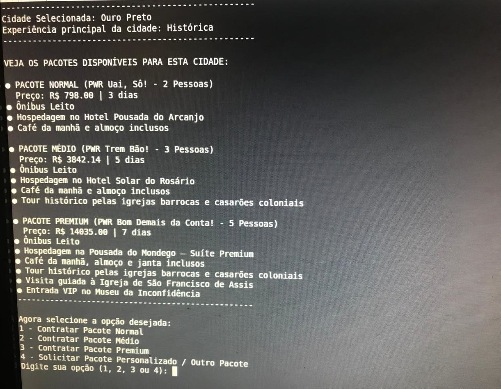
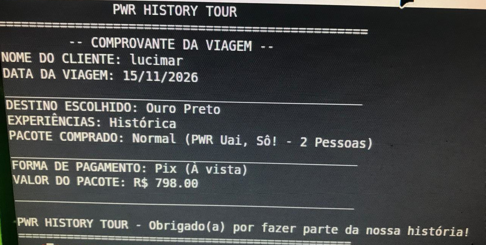

# 🗺️ PWR History Tour - Sistema de Vendas Automatizado

O **PWR History Tour** é um sistema interativo desenvolvido em JavaScript rodando diretamente no terminal (Node.js). O objetivo principal do projeto é oferecer um fluxo simplificado e inteligente para clientes interessados em explorar cidades históricas de Minas Gerais através de pacotes turísticos completos, centralizando a experiência cultural, histórica e gastronômica de forma organizada e prática.

Este projeto consolida a aplicação prática dos conceitos fundamentais da lógica de programação e arquitetura em JavaScript estudados ao longo deste semestre.

---

## 👥 Desenvolvimento e Trabalho em Equipe
O projeto foi desenvolvido de forma colaborativa, dividindo o ecossistema em módulos específicos onde cada integrante ficou responsável por uma engrenagem vital do motor (como recepção, banco de dados, fluxo de faturamento e geração de relatórios). Essa sinergia foi fundamental para aplicar na prática conceitos de versionamento de ideias, divisão de tarefas e escopo de funções de alto nível.

---
## 🎥 Demonstração em Vídeo

Aqui está o sistema rodando completo diretamente no terminal Linux:

<video src="midia_pwr/execute_terminal.mp4" width="100%" controls></video>

---

## 📸 Capturas de Tela (Interface do Usuário)

Veja abaixo como as telas de navegação e o comprovante final são exibidos de forma limpa:




## ⚡ Os Dois Fluxos do Sistema

Para garantir uma excelente experiência comercial e flexibilidade de atendimento, a lógica do programa foi mapeada e dividida em **dois fluxos principais independentes**:

### 🛒 1. Fluxo de Pacote Padrão (E-commerce de Prateleira)
Destinado a usuários que escolhem opções pré-definidas no catálogo inteligente (Normal, Médio ou Premium):
* O cliente seleciona o destino histórico desejado.
* Analisa a vitrine dinâmica de preços, durações e benefícios exclusivos.
* Passa por uma esteira de faturamento e validação de regras de negócio (como bloqueio automatizado para menores de 18 anos).
* Escolhe e processa a forma de pagamento (Pix, Débito ou Crédito parcelado).
* **Encerramento:** O sistema unifica todas as variáveis memorizadas ao longo da sessão e gera um **Comprovante de Compra Final** personalizado na tela.

### 🛠️ 2. Fluxo de Pacote Personalizado (Consultoria Exclusiva)
Ativado caso as opções do catálogo não atendam completamente às necessidades do usuário:
* Ao selecionar a opção de personalização, a estrutura aciona um desvio condicional (`if/return`) que interrompe a esteira padrão de faturamento.
* Entra em um loop de validação de dados restrito (garantindo strings válidas para nomes e coletando apenas numerais para o telefone).
* **Encerramento:** Fornece um feedback imediato de atendimento consultivo, informando que a equipe comercial entrará em contato em até 2 horas para desenhar o roteiro sob medida, encerrando o programa de forma limpa.

---

## 🛠️ Tecnologias e Conceitos Aplicados
* **Ambiente de Execução:** Node.js (Terminal)
* **Biblioteca Utilizada:** `prompt-sync` (para capturar entradas síncronas do usuário de forma segura).
* **Banco de Dados (Mock):** Uso de arrays de objetos complexos e estruturados para armazenar destinos, pacotes e propriedades de preços.
* **Funções e Escopo:** Modularização do sistema através de funções especialistas integradas por uma função central maestrina (`executarSistema`).
* **Estruturas de Repetição e Validação:** Loops do tipo `while(true)` combinados com tratamento de erros (`isNaN`, checagem de strings vazias e regras de maioridade).
* **Interatividade de Interface:** Uso avançado de limpeza de buffer visual (`console.clear()`) e manipulação de strings com Template Literals (crases) para formatação limpa no terminal.

---

## 🚀 Como Rodar o Projeto Localmente

1. Certifique-se de ter o [Node.js](https://nodejs.org/) instalado em sua máquina.
2. Clone o repositório ou baixe o arquivo `app.js` (ou `sistemaAgencia.js`).
3. Abra o terminal na pasta do arquivo e instale a dependência necessária:
   ```bash
   npm install prompt-sync
